# Chen Xiangdong的作品集

## 1.   智慧岛 — 一体化智能导学平台项目

随着人工智能技术的兴起，AI+教育成为教育行业举足轻重的赛道。自适应学习（其本质就是智能导学系统）是AI+教育非常核心的应用，百度、科大讯飞、新东方、好未来、松鼠AI等知名企业纷纷入局，可见智能导学系统的前景、效益空间巨大。

高等学校是国内智能人工教育的一个缺口，在校高校大学生及考研群体总人数达4000万，是人工智能教育的一片蓝海。大学多以题海战术应对考试，忽略了考生个体差异和学习能力，导致学生学习效率并不高，对大量的考试和题目产生厌倦心理。知识图谱是互联网时代下，计算机技术发展的产物，通过实体与实体关系描述现实世界中事物之间的联系。通过知识图谱，学生、题目和知识点被有机结合在一起，反映学生对知识点的学习效果。不仅可以提高学生的学习兴趣，提高学生的学习效率，教师也可以通过查看每个学生的学习情况，督促知识掌握程度低的学生进一步学习。因此，设计的基于知识图谱的在线智能学习系统对基础教育事业的发展具有重要意义。

**演示：**

<center>
<figure>
 
</figure>
</center>

**辅导聊天机器人：**
<center>
<figure>
 
</figure>
</center>

**辅导聊天机器人训练预料：**
```
你好
别来无恙。

什么是二元关系？
答：二元关系（英语：Binary relation，或简称关系）用于讨论两种物件的连系。诸如算术中的“大于”及“等于”、几何学中的“相似”或集合论中的“为……之元素”、“为……之子集”。

什么是自反？
答： 设 R是 A上的一个二元关系，若对于 A中的每一个元素 a， <a,a>都属于 R，则称 R为自反关系。

自反举例？
答：例如，A上的全域关系（超链接）Ea、恒等关系Ia都是A上的自反关系。

全域关系
答：全域关系(universal relation)亦称全关系。一种特殊关系：指A与B上的全关系R=AXB，基数大于1的集合上的全域关系是自反的、对称的和传递的，但不是反自反的和反对称的，全域关系的关系矩阵中所有元素都是1。

离散数学的圈是什么意思？
答：表示复合关系。举例：F圈G代表：G左复合F。比如，F=<2,3> G=<3,4>，则F圈G=<2,4>

还是不知道怎么做
答：提示一下，自反性的性质

自反性的性质
答：根据二元关系的运算规律，两个二元关系的右复合只有自反性保持不变。

哦懂了
答：嗯！加油，你一定可以的。

记笔记
答：我会记下你所说的，并且不会自动回复，你可以随时喊“停”就可以再次与我对话啦(lll￢ω￢)~~

二元关系的右复合只有自反性保持不变。
停
答：我记下啦，下次查看题目的时候，可以输入“笔记”让我显示他们，或者到【个人中心】-》【笔记】查看哦~
答：你可以试着答题啦~
```
**DialogFlow:**
<center>
<figure>
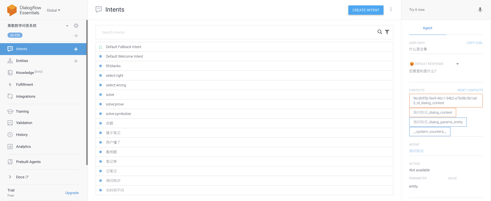 
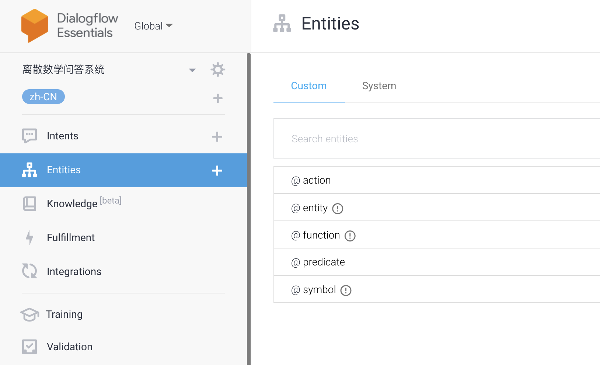 
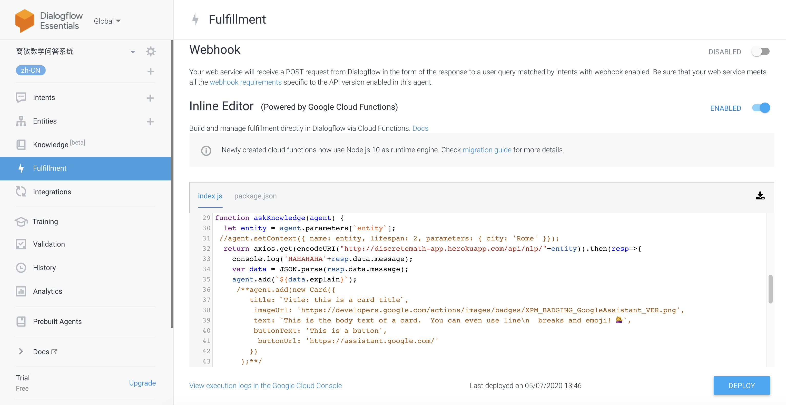 
</figure>
</center>

### 2.  智能顾投：人人通金融推荐平台

**算法解释：**
<center>
<figure>
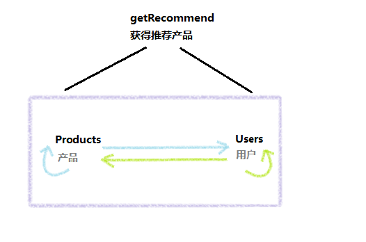 
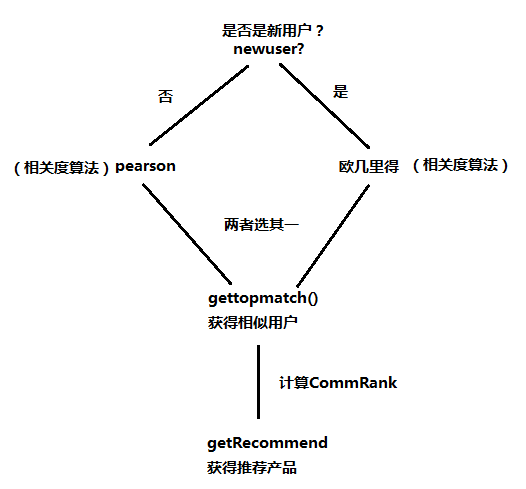 
</figure>
</center>

**截图：**
<center>
<figure>
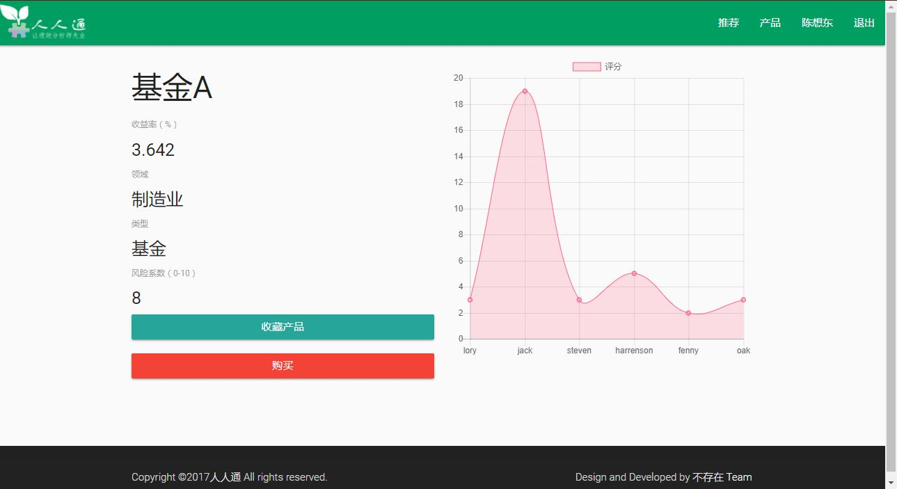 
 
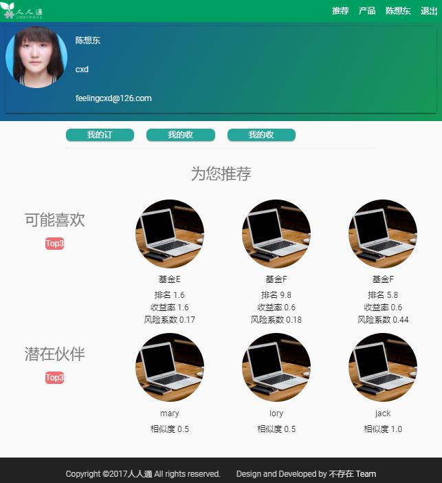 
</figure>
</center>

**演示：**
<center>
<video src="https://cxdstorage.blob.core.windows.net/blog/0.mp4" controls="controls">
您的浏览器不支持 video 标签。
</video>
</center>

## 3. workmates 团队协同管理网站
受启发于团队开发产品过程中的经验教训，比如人员组织不齐，项目进度容易拖拉、缺乏效率，角色分配引发争议等等问题。我们决定做一个“团队工作管理”网站。我们希望为用户，特别是工作团队提供一套全方位的“工作流程”监管平台。 

<center>
<figure>
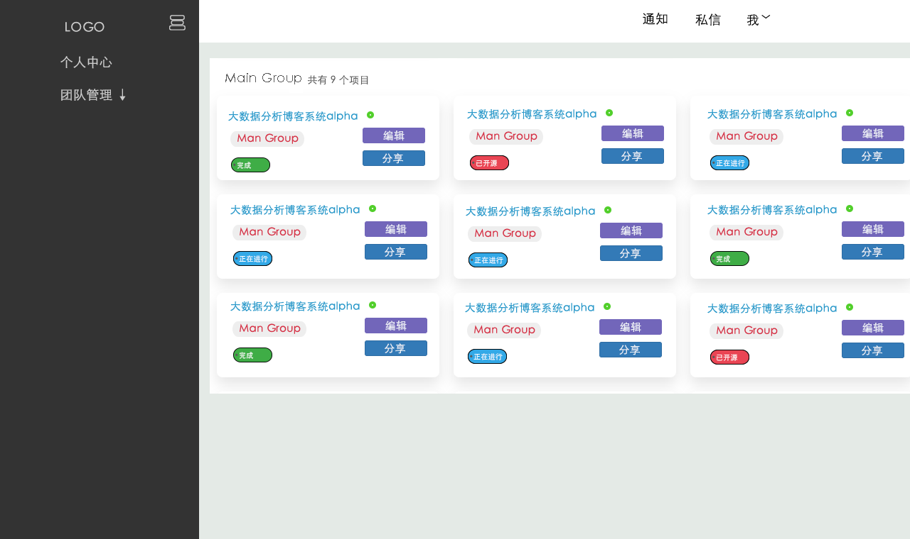 
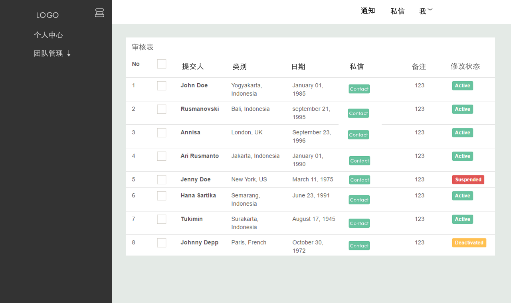 
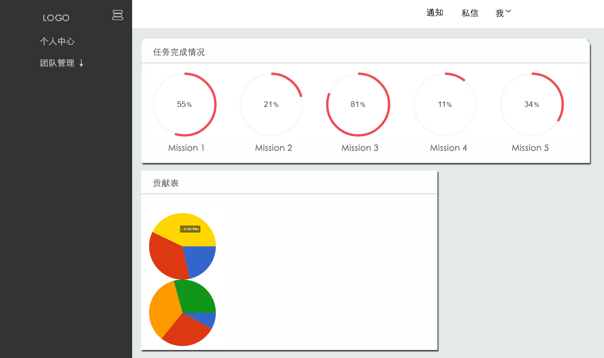 
</figure>
</center>

<center>
<figure>
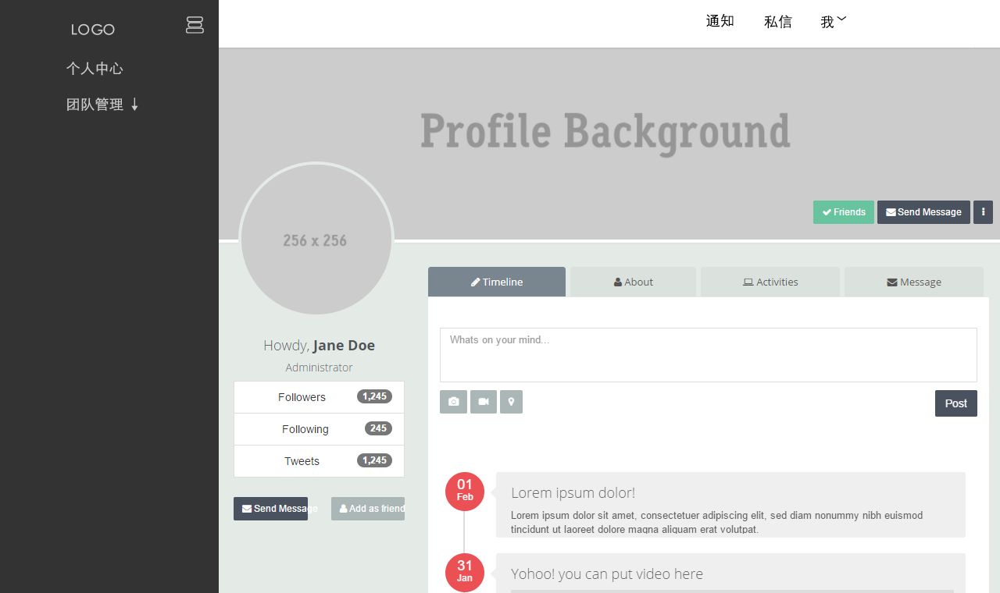 
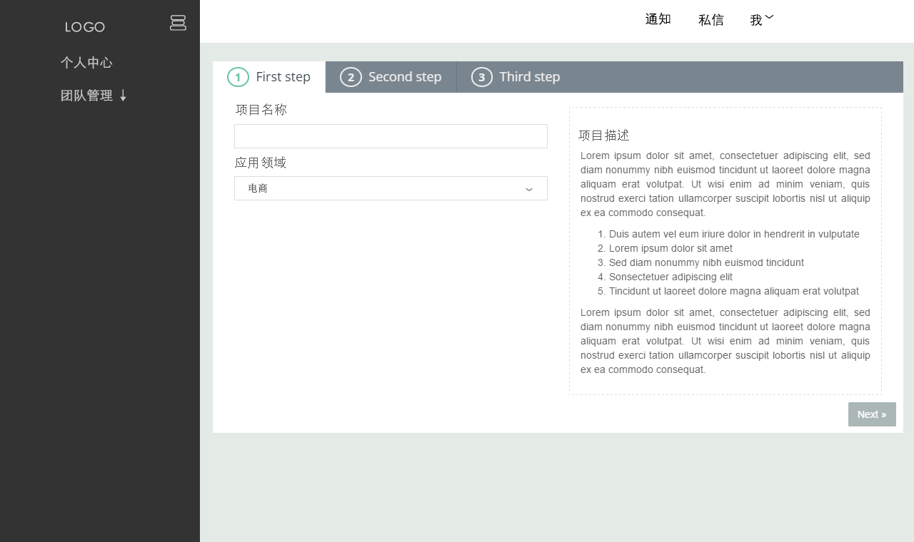 
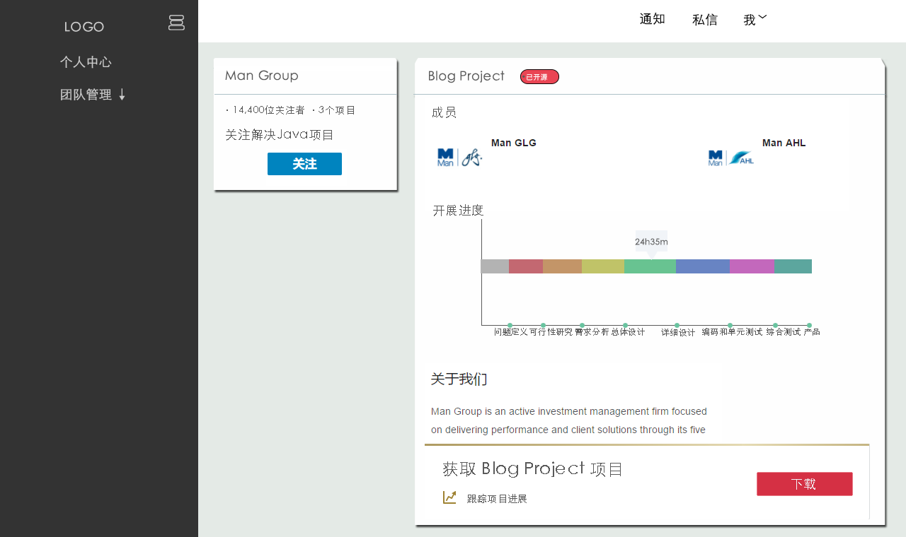 
</figure>
</center>

## 4. 通鹤后台管理系统

**演示：**

<center>
<video src="https://cxdstorage.blob.core.windows.net/blog/tonghe.mp4" controls="controls">
您的浏览器不支持 video 标签。
</video>
</center>

## 5. 游戏
### 5.1 翻转英雄
本作品创意来源于国际大热动画“海绵宝宝”，我们将其放入太空大战的背景当中，加入“竞速”与“碰撞”的游戏元素，制作一款玩法新颖，具有新意，能在多平台上兼容的三维游戏。

从创意和从功能需求上来说，本游戏与传统的冒险撞击类游戏不同，除了实现基本的菜单选择、场景转换、本地存储等功能外，还独具特色地加入了“环境因素”、通过场景转换来躲避敌人。

**截图：**
<center>
<figure>
 
 
 
</figure>
</center>

**演示：**

<center>
<video src="https://cxdstorage.blob.core.windows.net/blog/cubehero.mp4" controls="controls">
您的浏览器不支持 video 标签。
</video>
</center>

### 5.2 钢琴英雄
本作品力求既能使没有乐理基础的人也能利用该游戏弹奏出美妙的曲子，也能在游戏中休闲益智，让乐理变得简单有趣。对于儿童来说，是一款音乐钢琴启蒙游戏工具，对于成人来说，是一款有趣的益智游戏，可以在游戏过程中享受音乐，享受声音变成可视化的数字图像的魅力。
<center>
<figure>
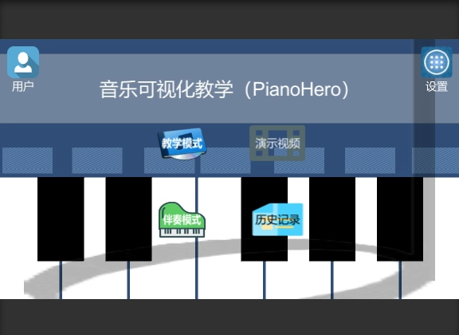 
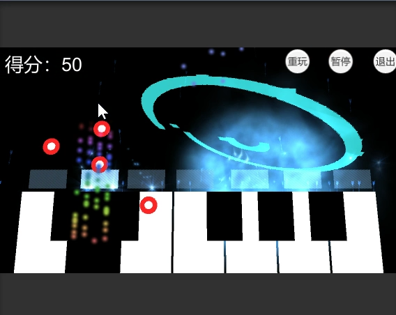 
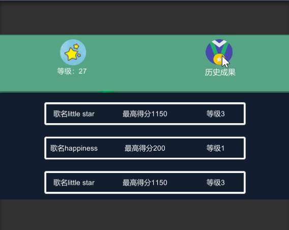 
</figure>
</center>

### 5.3 孔子教学游戏
为了激发青少年对儒家文化的兴趣，鼓励他们利用空闲时间进行儒家文化的学习，我们小组设想能够依靠手机这个巨大的传播平台，开发出一款具有以下特点：实用性强、传播性广、用户粘度大的“儒家文化学习平台”。
该平台以传播和学习“儒家经典文化”为宗旨，可以提供文字教学、论坛交流、游戏测试等多方面内容。
本软件主要由以下几个大模块构成：
1.	学习板块。包括“人物”和“朝代”两个子版块，列举了儒家文化的代表性人物，及其相关著作和名言警句。可以供用户平时的查询和文字教学之用。
2.	交流板块。该板块以论坛的形式进行，主要是为了进一步抓住用户注意力，让学习之后有疑惑的用户有一个交流的空间。
3.	游戏测试板块。该板块模仿了大富翁的游戏模式，主要是为了能吸引住用户，让用户在游戏中答题，检验学习成果。

<center>
<figure>
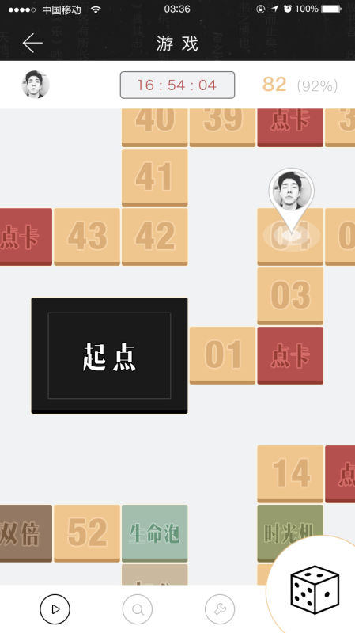 
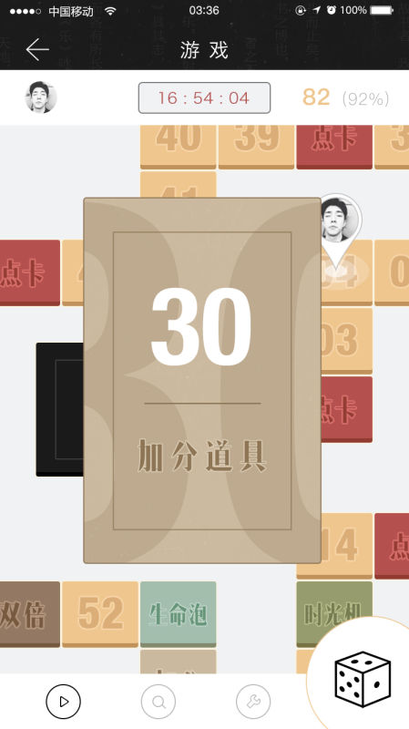 
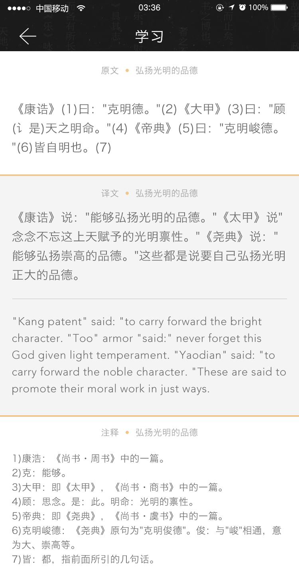 
</figure>
</center>


## 6. 前端作品
### 6.1 在线便签纸 Using Firebase
### Easy-connect Stickers

<center>
<figure>
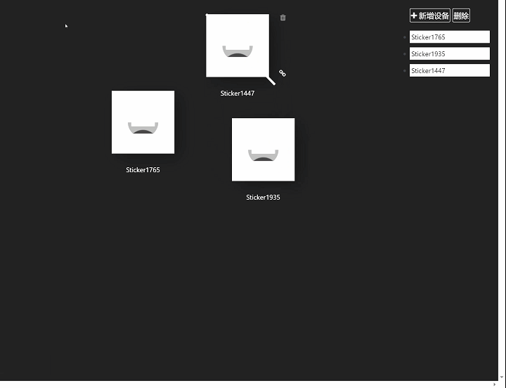 
</figure>
</center>

You can find this one at https://codepen.io/cxd/pen/zEwpBx.

### You can add multiple stickers, edit their content, drag and drop and connect lines. Isn't it great?

<center>
<figure>
 
</figure>
</center>

### 6.2 时间轴 Using Firebase
A Pen created at CodePen.io. You can find this one at https://codepen.io/cxd/pen/zEzQMd.

<center>
<figure>
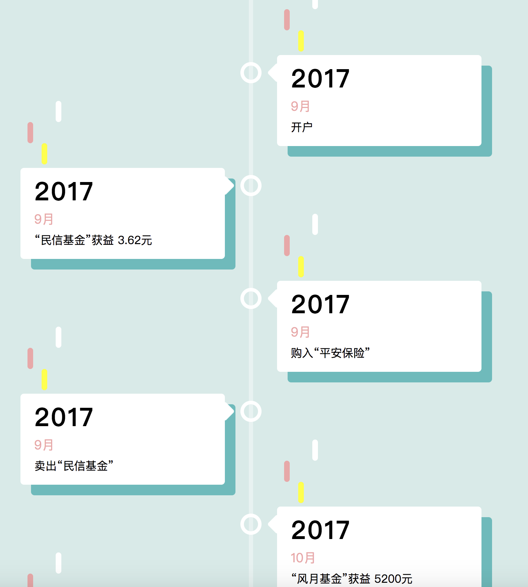 
</figure>
</center>

```javascript
// Initialize Firebase
  var config = {
    apiKey: "******",
    authDomain: "pretty-timeline.firebaseapp.com",
    databaseURL: "https://pretty-timeline.firebaseio.com",
    projectId: "pretty-timeline",
    storageBucket: "pretty-timeline.appspot.com",
    messagingSenderId: "******"
  };
  firebase.initializeApp(config);

var eventRef = firebase.database().ref('events');
eventRef.on('value', function(snapshot) {
  vm.events = snapshot.val();
});
    
var vm = new Vue({
    el: "#app",
    data:{
      events: [],
    },
    methods:{
      setTag(lid,cid){
        let text = prompt("请输入新的文字",this.events[lid].content[cid].tag)
      if(text){
        this.events[lid].content[cid].tag = text
        eventRef.child(lid).set(this.events[lid])
        }
      },
      addTag(){
        var k = eventRef.push({
           year: new Date().getFullYear(),
           content:[{
             month: new Date().getMonth() + 1,
             tag: "文字"
           }]
        })
      }
    }
})
```

### 6.3 雷达图
A Pen created By [Chen Xiangdong](https://codepen.io/cxd). You can find this one at https://codepen.io/cxd/pen/PJKxpY.
<center>
<figure>
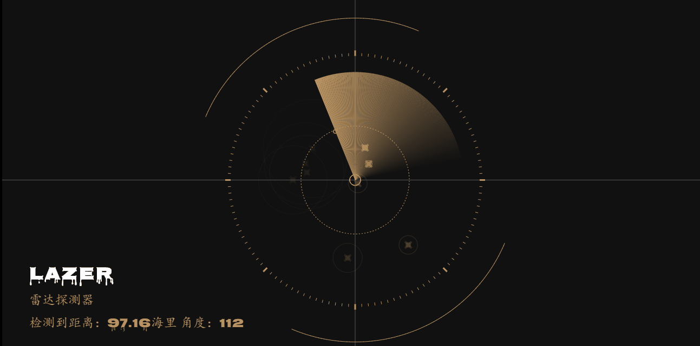 
</figure>
</center>

### 6.4 时间轴
A Pen created at CodePen.io. You can find this one at https://codepen.io/cxd/pen/bovEPE.

### 6.5 我的家乡-svg可交互地图
A Pen created at CodePen.io. You can find this one at https://codepen.io/cxd/full/rPWmaa.
<center>
<figure>
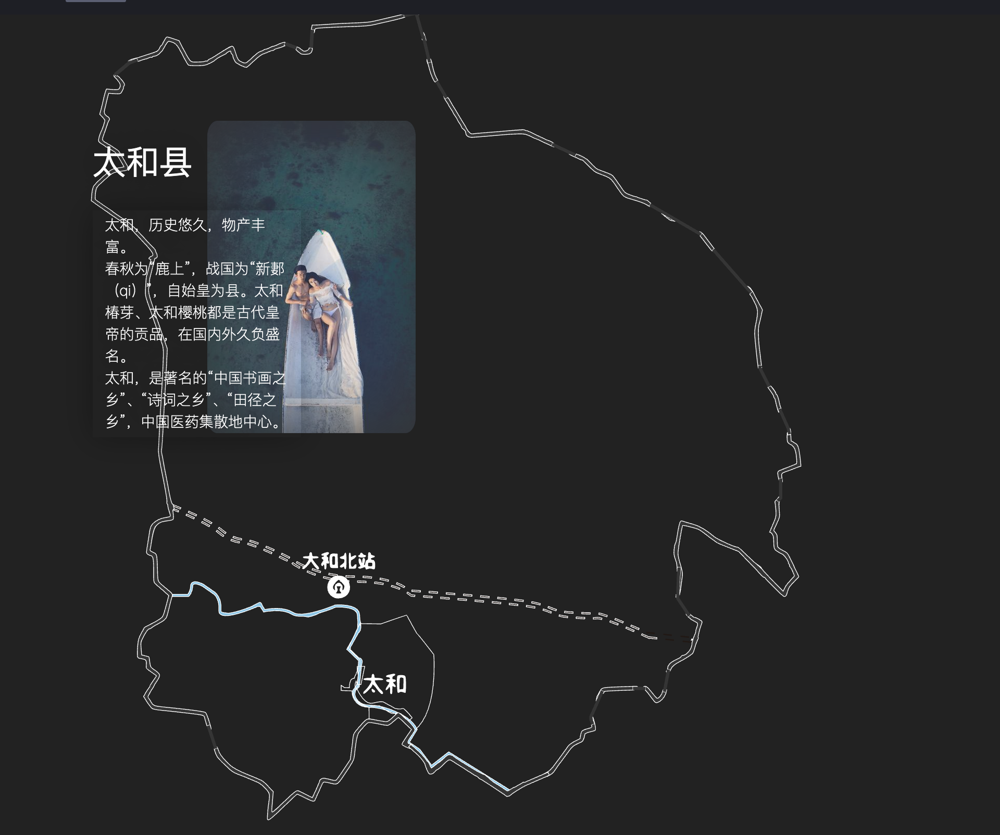 
</figure>
</center>

## End